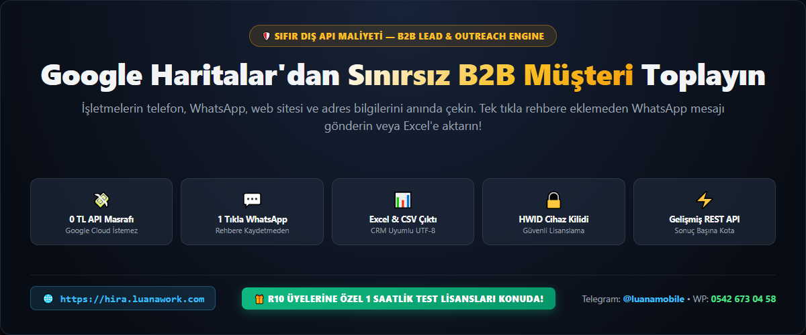
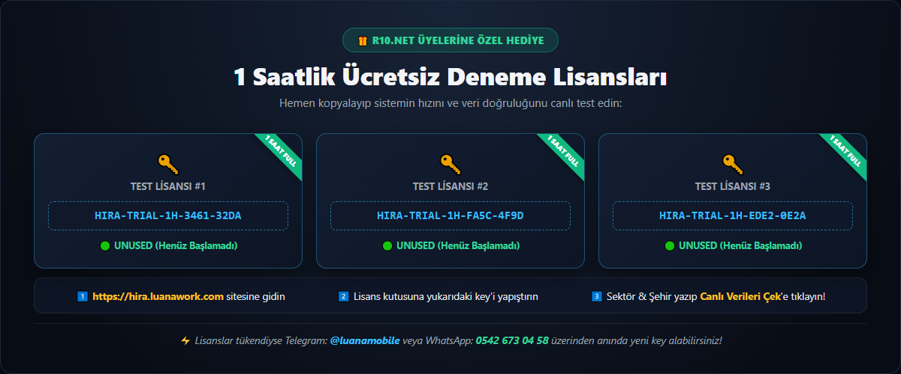
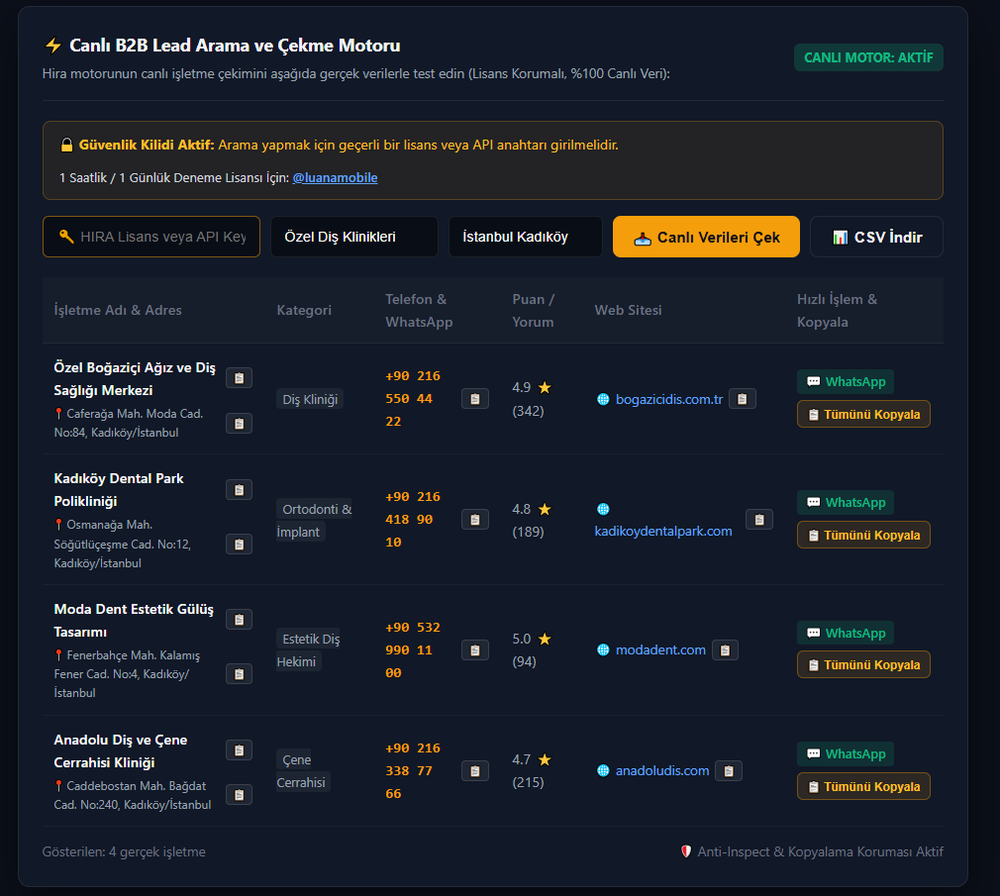
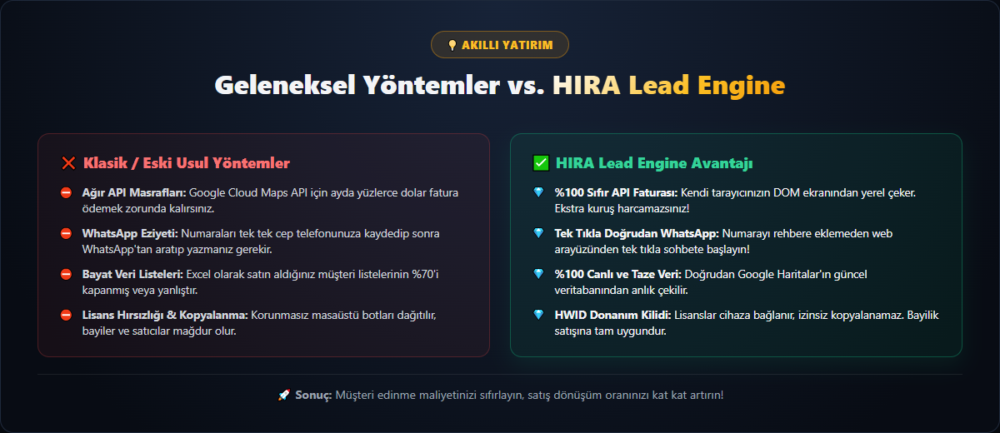
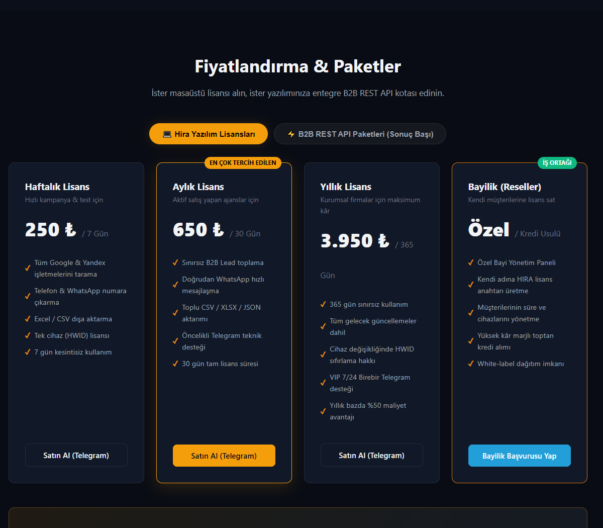
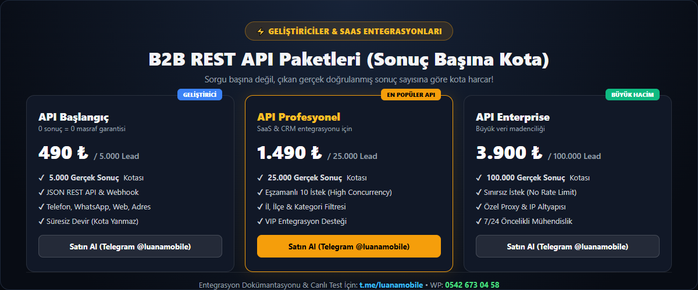

# Hira Lead Engine ? B2B M??teri & Lead ??kar?c? | Google Maps & WhatsApp Otomasyonu

---

## ???? T?rk?e Tan?t?m

### Genel Bak??
**Hira Lead Engine** ([https://hira.luanawork.com/](https://hira.luanawork.com/)); haritalar ve web ?zerindeki t?m i?letmelerin telefon, WhatsApp, web sitesi ve adres bilgilerini s?f?r harici API ?cretiyle saniyeler i?inde ?eken, tek t?kla do?rudan WhatsApp mesaj? ba?latan yeni nesil bir B2B M??teri & Lead otomasyon platformudur.

> ?? **Not:** Bu repo, projenin a??k kaynak portf?y ve g?rsel tan?t?m (Showcase) deposudur. Ticari kaynak kodlar? hari? tutulmu?tur.

### ?? Temel ?zellikler
- **%100 S?f?r D?? API Maliyeti:** Google Cloud API veya OpenAI gerektirmez. Taray?c?n?z ?zerinden DOM tabanl? yerel veri ?eker.
- **Tek T?kla Do?rudan WhatsApp:** Toplanan numaralar? telefon rehberine kaydetmeden aray?z ?zerinden an?nda WhatsApp Web sohbeti a?ar.
- **HWID Donan?m Kilidi:** Her lisans kullan?c?n?n cihaz?na kilitlenir; g?venli da??t?m ve bayilik sat???na uygundur.
- **Excel, CSV ve JSON ??kt?s?:** CRM sistemlerine (Hubspot, Excel vb.) tek t?kla aktar?labilir T?rk?e UTF-8 BOM ??kt?s?.
- **Bayilik (Reseller) Altyap?s?:** Kendi m??terilerinize alt lisans ?retip satabilece?iniz bayi portal?.
- **Geli?tiriciler ??in REST API:** Sorgu ba??na de?il, ??kan ger?ek do?rulanm?? sonu? say?s?na g?re kota harcayan API.

### ?? R10.net ?yelerine ?zel 1 Saatlik ?cretsiz Deneme Lisanslar?
A?a??daki lisans anahtarlar?n? [https://hira.luanawork.com/](https://hira.luanawork.com/) adresindeki canl? arama kutusuna girerek sistemi hemen test edebilirsiniz:

| Lisans Anahtar? | S?re | Durum |
|---|---|---|
| `HIRA-TRIAL-1H-3461-32DA` | 1 Saat | UNUSED (Bo?ta) |
| `HIRA-TRIAL-1H-FA5C-4F9D` | 1 Saat | UNUSED (Bo?ta) |
| `HIRA-TRIAL-1H-EDE2-0E2A` | 1 Saat | UNUSED (Bo?ta) |

### ?? Ekran G?r?nt?leri & Afi?ler

### ?? ?leti?im & Geli?tirici (Contact)
- **Telegram:** [@luanamobile](https://t.me/luanamobile)
- **WhatsApp:** [0542 673 04 58](https://wa.me/905426730458)
- **Resmi Web Sitesi:** [https://hira.luanawork.com/](https://hira.luanawork.com/)

---

## ???? English Overview

### About Hira Lead Engine
**Hira Lead Engine** ([https://hira.luanawork.com/](https://hira.luanawork.com/)) is an advanced B2B customer & lead extraction platform designed to gather verified business phone numbers, WhatsApp contacts, websites, and physical addresses directly from maps and the web with zero external API fees.

> ?? **Notice:** This repository is the official public media showcase and portfolio. Source code files are omitted for commercial protection.

### ?? Key Highlights
- **Zero External API Cost:** No expensive Google Cloud or OpenAI API bills. Scrapes locally via browser DOM extraction.
- **1-Click Direct WhatsApp:** Send messages immediately via WhatsApp Web without saving numbers to contacts.
- **HWID Hardware Lock:** Licenses lock securely to the machine hardware, preventing unauthorized distribution and enabling reseller networks.
- **CRM Ready Data Exports:** Download leads in clean, UTF-8 encoded Excel, CSV, or JSON formats.
- **Reseller Portal:** Issue, track, and resell licenses directly to your own clients with profit margins.
- **Developer REST API:** Charged strictly by successful verified results returned, not by empty query attempts.

### ?? Contact & Developer
- **Telegram:** [@luanamobile](https://t.me/luanamobile)
- **WhatsApp:** [+90 542 673 04 58](https://wa.me/905426730458)
- **Official Website:** [https://hira.luanawork.com/](https://hira.luanawork.com/)
